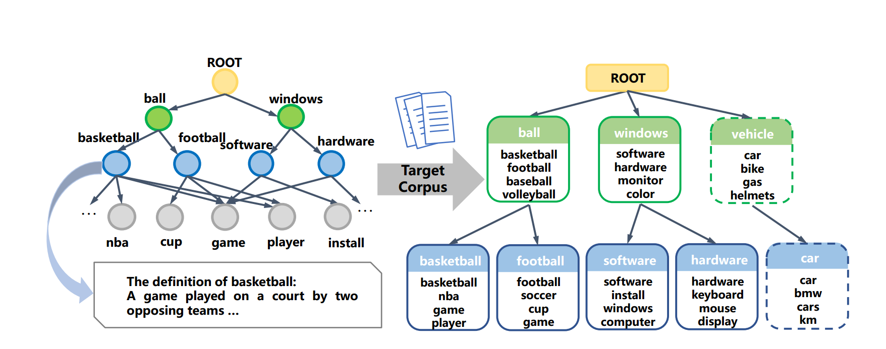

# Knowledge-Aware Bayesian Deep Topic Model

This is the repo for our paper [Knowledge-Aware Bayesian Deep Topic Model](https://arxiv.org/abs/2209.14228)
in NeurIPS2022.

In this paper, we propose a novel Bayesian-aware framework for incorporating knowledge graph into deep generative model. Knowledge graph contains a lot of side information and 
common sense, and holds great potential to improve the performance and interpretability of most purely data-driven models. However, most existing topic models mainly focus on 
the word co-occurrence patterns, ignoring such easy-to-obtain prior domain knowledge, such as topic hierarchies in WordNet. Or several knowledge-based topic models only 
applicable to shallow hierarchies or sensitive to the quality of the provided prior knowledge. To this end, we develop a novel deep ETM that jointly models 
the documents and the given prior knowledge by embedding the words and topics into the same space. Guided by the provided knowledge, the proposed model tends to discover 
topic hierarchies that are organized into interpretable taxonomies. Besides, with a technique for adapting a given graph, our extended version allows the provided prior
topic structure to be finetuned to match the target corpus.

code is coming.
